# Apache Cassandra + Spring Boot

A comprehensive learning project demonstrating **Apache Cassandra** integration with **Spring Boot**, covering CRUD operations, user-defined types, collections, TTL, batch writes, lightweight transactions, SASI indexes, materialized views, JWT authentication, counter tables, and advanced CQL queries.

---

## Tech Stack

| Component | Version |
|-----------|---------|
| Java | 25 |
| Spring Boot | 4.1.1 |
| Apache Cassandra | 5.0 |
| Spring Data Cassandra | (via starter) |
| Spring Security + JWT | (jjwt 0.13.0) |
| Lombok | 1.18.46 |
| Docker Compose | (for Cassandra) |

---

## Project Structure

```
cassandra/
├── docker-compose.yml              # Cassandra 5.0 container
├── pom.xml                         # Maven dependencies
├── src/main/java/com/sawmik/cassandra/
│   ├── CassandraApplication.java   # Entry point
│   ├── config/
│   │   ├── AppConfig.java          # CORS + JWT properties binding
│   │   ├── CassandraConfig.java    # Two-phase CqlSession init
│   │   ├── SecurityConfig.java     # Spring Security filter chain
│   │   ├── GlobalExceptionHandler.java  # Centralized error handling
│   │   └── ViewInitializer.java    # Materialized view creation on startup
│   ├── entity/
│   │   ├── User.java
│   │   ├── Product.java
│   │   ├── Article.java
│   │   ├── LogEntry.java
│   │   ├── Employee.java
│   │   ├── Event.java
│   │   ├── Location.java
│   │   ├── MetricsCounter.java
│   │   ├── SensorReading.java
│   │   └── SensorReadingKey.java   # Composite primary key
│   ├── udt/
│   │   ├── Review.java             # User Defined Type
│   │   ├── Address.java
│   │   └── Coordinate.java
│   ├── dto/
│   │   ├── auth/                   # RegisterRequest, LoginRequest, AuthResponse
│   │   ├── product/                # ProductRequest
│   │   ├── location/               # LocationRequest
│   │   └── user/                   # UserResponse
│   ├── repository/                 # 9 Cassandra repositories
│   ├── service/                    # 16 service classes
│   ├── controller/                 # 17 REST controllers
│   └── security/
│       ├── JwtTokenProvider.java
│       ├── JwtAuthenticationFilter.java
│       └── CustomUserDetailsService.java
└── src/test/
    └── CassandraApplicationTests.java
```

---

## Cassandra Schema

### Keyspace

```
cassandra_app (SimpleStrategy, replication_factor = 1)
```

### Tables Created

| Table | Primary Key | Description |
|-------|-------------|-------------|
| `users` | `id TEXT` | JWT authentication users |
| `products` | `id UUID` | Products with UDT reviews |
| `articles` | `id UUID` | Articles with list/set collections |
| `log_entries` | `id UUID` | Application log entries |
| `employees` | `id UUID` | Employees with set/map collections |
| `events` | `id UUID` | Events with map/set/list collections |
| `locations` | `id UUID` | Locations with Coordinate UDT |
| `sensor_readings` | `(sensor_id UUID, reading_time TIMESTAMP)` | Time-series data (composite key) |
| `metrics_counters` | `name TEXT` | Counter columns |

### User Defined Types (UDTs)

| UDT | Fields | Used By |
|-----|--------|---------|
| `review` | `reviewer TEXT, comment TEXT, rating INT` | `Product.reviews` |
| `coordinate` | `latitude DOUBLE, longitude DOUBLE` | `Location.coordinates` |
| `address` | `street, city, state, zipCode, country` | (created, available for use) |

### Materialized Views (6)

| View | Base Table | Partition Key | Purpose |
|------|-----------|---------------|---------|
| `products_by_category` | `products` | `(category, id)` | Query products by category |
| `articles_by_author` | `articles` | `(author, id)` | Query articles by author |
| `logs_by_level` | `log_entries` | `(level, id)` | Query logs by severity level |
| `locations_by_country` | `locations` | `(country, id)` | Query locations by country |
| `employees_by_department` | `employees` | `(department, id)` | Query employees by department |
| `events_by_type` | `events` | `(event_type, id)` | Query events by type |

---

## Architecture Flow

### Application Startup Flow

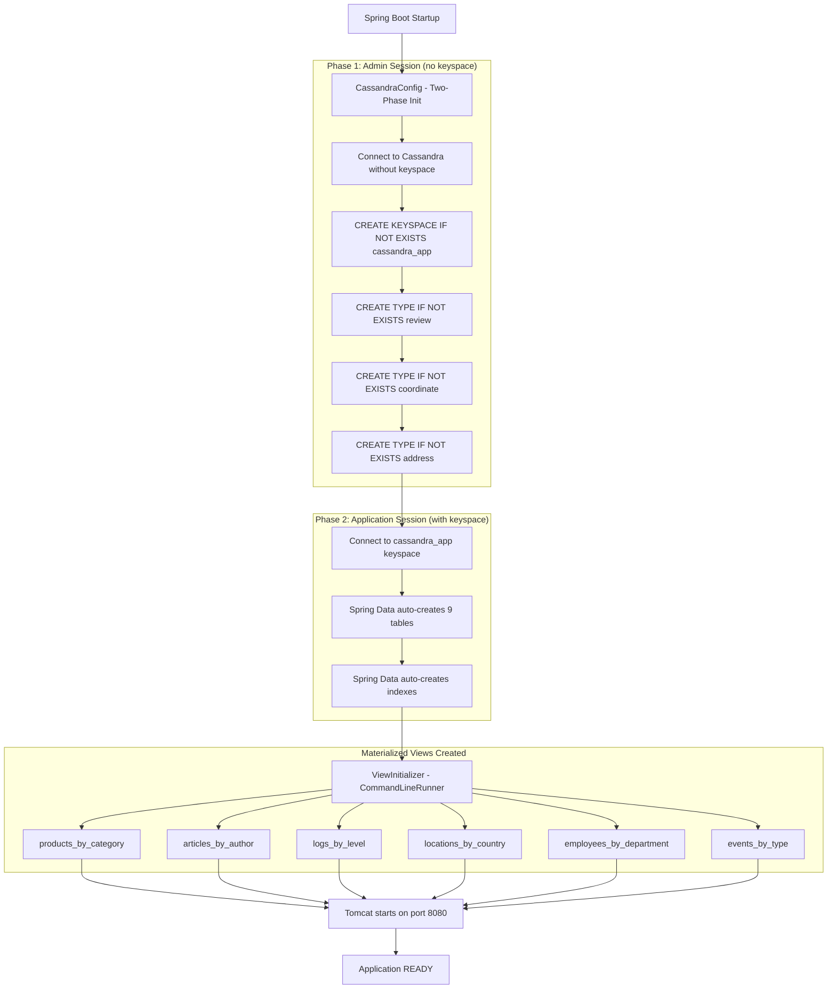

### Authentication Flow (JWT)

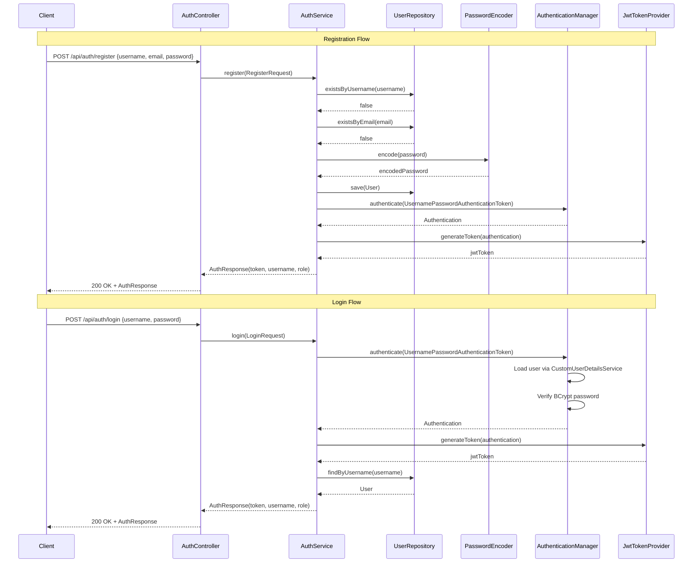

### Request Authentication Flow (JWT Filter)

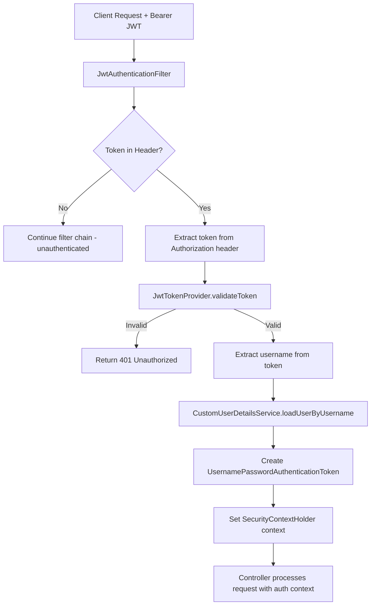

### Security Rules Flow

```mermaid
flowchart TD
    A[Incoming Request] --> B{Path matches /api/auth/**?}
    B -->|Yes| C[permitAll - No auth required]
    B -->|No| D{Path matches /actuator/health?}
    D -->|Yes| E[permitAll - No auth required]
    D -->|No| F{Path matches /api/admin/**?}
    F -->|Yes| G{hasRole ADMIN?}
    F -->|No| H{Path matches GET /api/products,articles,logs,...?}
    H -->|Yes| I[authenticated - Any valid JWT]
    H -->|No| J[.anyRequest().authenticated]
    
    G -->|Admin role| K[Access granted]
    G -->|Non-admin| L[403 Forbidden]
    I -->|Valid token| K
    I -->|No/invalid token| M[401 Unauthorized]
    J -->|Valid token| K
    J -->|No/invalid token| M
```

### Product CRUD Flow

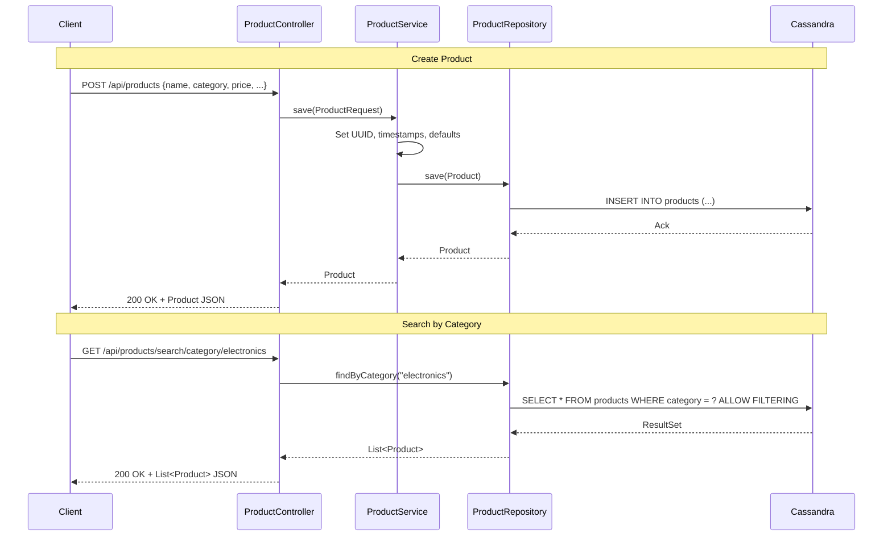

### Time-Series Data Flow (Sensor Readings)

```mermaid
flowchart TD
    subgraph CompositeKey["Composite Primary Key"]
        PK[Partition Key: sensor_id UUID]
        CK[Clustering Key: reading_time TIMESTAMP ASC]
    end

    subgraph Write["Write Flow"]
        W1[POST /api/sensors/:sensorId/readings] --> W2[Create SensorReadingKey]
        W2 --> W3[Create SensorReading]
        W3 --> W4[repository.save]
        W4 --> W5[INSERT INTO sensor_readings<br/>VALUES sensor_id, reading_time, value, unit]
    end

    subgraph ReadRange["Read by Time Range"]
        R1[GET /api/sensors/:id/readings/range?start=&end=] --> R2[findBySensorIdAndIdReadingTimeBetween]
        R2 --> R3[SELECT * FROM sensor_readings<br/>WHERE sensor_id = ?<br/>AND reading_time >= ? AND reading_time <= ?<br/>ORDER BY reading_time ASC]
    end

    subgraph ReadLatest["Read Latest N"]
        L1[GET /api/sensors/:id/readings/latest?limit=10] --> L2[findLatestReadings]
        L2 --> L3[SELECT * FROM sensor_readings<br/>WHERE sensor_id = ?<br/>ORDER BY reading_time DESC LIMIT ?]
    end
```

### Counter Table Flow (Metrics)

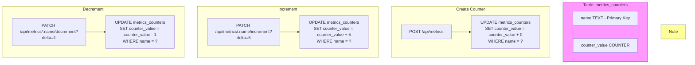

> **Note:** Counter columns can ONLY be incremented/decremented. You cannot set them to an arbitrary value.

### TTL (Time-To-Live) Flow

```mermaid
flowchart TD
    subgraph Insert["Insert with TTL"]
        I1[POST /api/admin/ttl/:table] --> I2[INSERT INTO table (...)<br/>VALUES (...)<br/>USING TTL 300]
        I2 --> I3[Data auto-expires after 300 seconds]
    end

    subgraph Read["Read with TTL"]
        R1[GET /api/admin/ttl/:table] --> R2[SELECT *, TTL(id) as ttl<br/>FROM table]
        R2 --> R3[Returns remaining TTL for each row]
    end

    subgraph Update["Update TTL"]
        U1[PUT /api/admin/ttl/:table/:id?ttlSeconds=600] --> U2[Read existing row]
        U2 --> U3[Re-insert with new TTL]
        U3 --> U4[TTL cannot be updated in-place]
    end
```

### Batch Write Flow

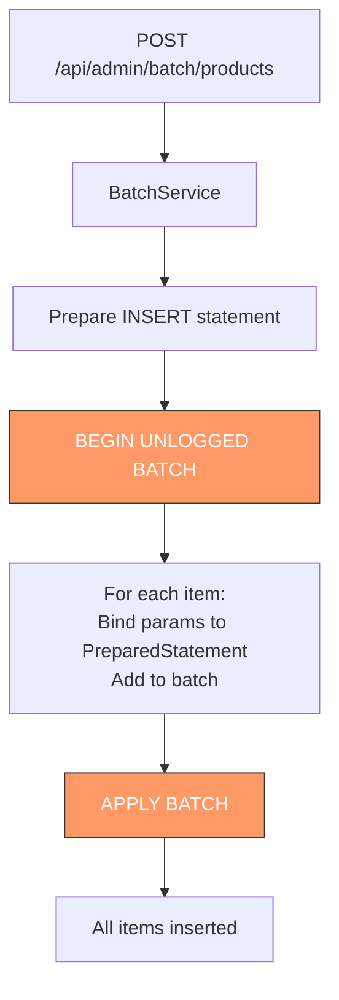

> **Note:** UNLOGGED batches do NOT guarantee atomicity across partitions. They are for performance, not for transactions.

### Lightweight Transaction (LWT) Flow

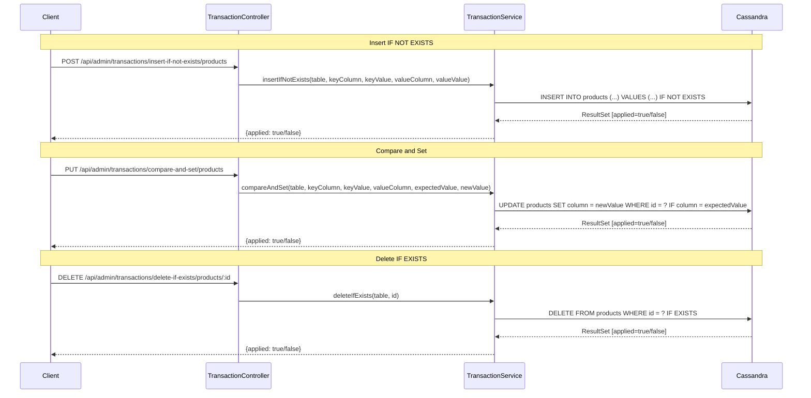

> **Note:** LWT uses Paxos consensus. Performance cost: ~2x normal writes. Not recommended for high-throughput scenarios.

### Collection Operations Flow

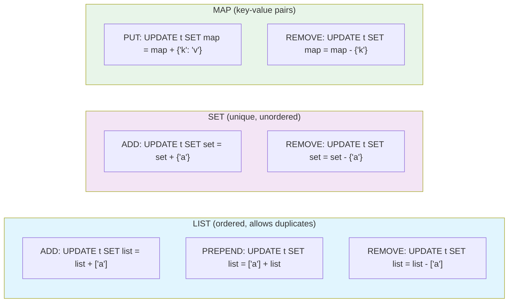

### SASI Index Flow

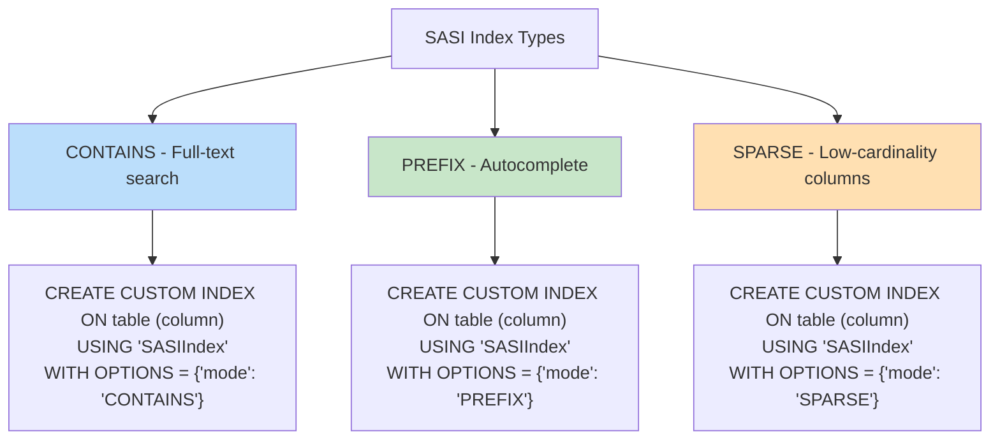

### Advanced Query Flow (Consistency Levels)

```mermaid
flowchart TD
    A[POST /api/admin/advanced/query/consistency/QUORUM] --> B[Parse consistency level from URL]
    B --> C[Create SimpleStatement from CQL]
    C --> D[Set consistency on statement]
    D --> E[Execute via CqlSession]
    E --> F[Return results as List of Map]

    subgraph Levels["Consistency Levels"]
        L1[ONE - 1 replica must respond]
        L2[QUORUM - (RF/2)+1 replicas respond]
        L3[ALL - All replicas must respond]
        L4[LOCAL_QUORUM - (RF/2)+1 in local DC]
    end

    G[Trade-off] --> H[Higher consistency = More latency + Higher availability]
    G --> I[Lower consistency = Less latency + Lower availability]

    style Levels fill:#fff3e0
```

### Token Range Query Flow

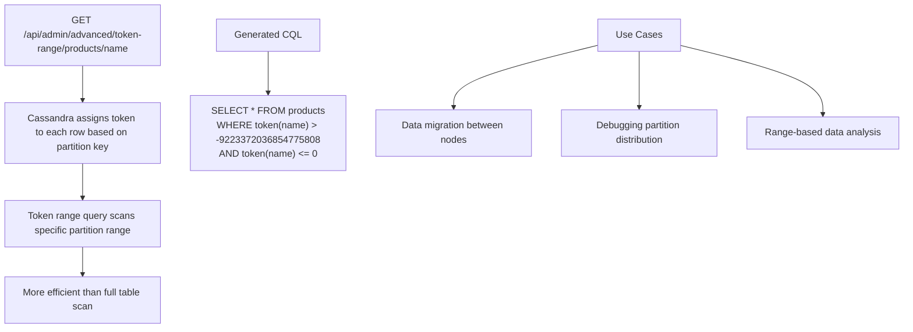

---

## Complete API Reference

### Authentication (No Auth Required)

| Method | Endpoint | Description |
|--------|----------|-------------|
| POST | `/api/auth/register` | Register new user |
| POST | `/api/auth/login` | Login and get JWT |

### Products

| Method | Endpoint | Description |
|--------|----------|-------------|
| POST | `/api/products` | Create product |
| GET | `/api/products` | List all products |
| GET | `/api/products/{id}` | Get product by ID |
| PUT | `/api/products/{id}` | Full update product |
| PATCH | `/api/products/{id}` | Partial update product |
| DELETE | `/api/products/{id}` | Delete product |
| DELETE | `/api/products` | Delete all products |
| GET | `/api/products/count` | Count all products |
| POST | `/api/products/bulk` | Bulk create products |
| DELETE | `/api/products/bulk` | Bulk delete products |
| GET | `/api/products/search/name/{name}` | Search by name |
| GET | `/api/products/search/category/{category}` | Search by category |
| GET | `/api/products/search/price?min=&max=` | Search by price range |
| GET | `/api/products/search/tag/{tag}` | Search by tag |
| GET | `/api/products/search/available/{bool}` | Search by availability |
| GET | `/api/products/search/category/{cat}/available/{avail}` | Combined search |
| GET | `/api/products/search/price-less-than/{price}` | Search price < value |
| GET | `/api/products/count/category/{category}` | Count by category |
| GET | `/api/products/count/available/{bool}` | Count by availability |

### Articles

| Method | Endpoint | Description |
|--------|----------|-------------|
| POST | `/api/articles` | Create article |
| GET | `/api/articles` | List all articles |
| GET | `/api/articles/{id}` | Get article by ID |
| PUT | `/api/articles/{id}` | Update article |
| DELETE | `/api/articles/{id}` | Delete article |
| GET | `/api/articles/count` | Count all articles |
| POST | `/api/articles/bulk` | Bulk create articles |
| GET | `/api/articles/author/{author}` | Search by author |
| GET | `/api/articles/status/{status}` | Search by status |
| GET | `/api/articles/published/{bool}` | Search by published state |
| GET | `/api/articles/published-not-deleted` | Get published non-deleted |
| GET | `/api/articles/search/title/{title}` | Search by title |
| GET | `/api/articles/search/content/{content}` | Search by content |
| GET | `/api/articles/date-range?start=&end=` | Search by date range |
| GET | `/api/articles/count/author/{author}` | Count by author |
| GET | `/api/articles/count/status/{status}` | Count by status |
| PATCH | `/api/articles/{id}/view` | Increment view count |

### Log Entries

| Method | Endpoint | Description |
|--------|----------|-------------|
| POST | `/api/logs` | Create log entry |
| GET | `/api/logs` | List all logs |
| GET | `/api/logs/{id}` | Get log by ID |
| DELETE | `/api/logs/{id}` | Delete log |
| DELETE | `/api/logs` | Delete all logs |
| POST | `/api/logs/bulk` | Bulk create logs |
| GET | `/api/logs/level/{level}` | Search by level |
| GET | `/api/logs/service/{service}` | Search by service |
| GET | `/api/logs/level/{level}/service/{service}` | Combined search |
| GET | `/api/logs/response-code/{code}` | Search by response code |
| GET | `/api/logs/trace/{traceId}` | Search by trace ID |
| GET | `/api/logs/search/message/{message}` | Search by message |
| GET | `/api/logs/date-range?start=&end=` | Search by date range |
| GET | `/api/logs/level/{level}/date-range` | Level + date range |
| GET | `/api/logs/errors` | Get error logs (code >= 400) |
| GET | `/api/logs/slow?minDurationMs=1000` | Get slow requests |
| GET | `/api/logs/count/level/{level}` | Count by level |
| GET | `/api/logs/count/service/{service}` | Count by service |

### Locations

| Method | Endpoint | Description |
|--------|----------|-------------|
| POST | `/api/locations` | Create location |
| GET | `/api/locations` | List all locations |
| GET | `/api/locations/{id}` | Get location by ID |
| PUT | `/api/locations/{id}` | Update location |
| DELETE | `/api/locations/{id}` | Delete location |
| GET | `/api/locations/type/{type}` | Search by type |
| GET | `/api/locations/country/{country}` | Search by country |
| GET | `/api/locations/city/{city}` | Search by city |
| GET | `/api/locations/country/{country}/city/{city}` | Combined search |
| GET | `/api/locations/search/name/{name}` | Search by name |
| GET | `/api/locations/type/{type}/country/{country}` | Type + country |

### Employees

| Method | Endpoint | Description |
|--------|----------|-------------|
| POST | `/api/employees` | Create employee |
| GET | `/api/employees` | List all employees |
| GET | `/api/employees/{id}` | Get employee by ID |
| DELETE | `/api/employees/{id}` | Delete employee |
| GET | `/api/employees/department/{dept}` | Search by department |
| GET | `/api/employees/skill/{skill}` | Search by skill |

### Events

| Method | Endpoint | Description |
|--------|----------|-------------|
| POST | `/api/events` | Create event |
| GET | `/api/events` | List all events |
| GET | `/api/events/{id}` | Get event by ID |
| DELETE | `/api/events/{id}` | Delete event |
| GET | `/api/events/type/{type}` | Search by type |
| GET | `/api/events/type/{type}/range?start=&end=` | Type + time range |
| GET | `/api/events/type/{type}/latest?limit=10` | Latest N events |
| GET | `/api/events/type/{type}/page?size=10` | Paginated events |
| GET | `/api/events/count/type/{type}` | Count by type |

### Sensor Readings

| Method | Endpoint | Description |
|--------|----------|-------------|
| POST | `/api/sensors/{sensorId}/readings` | Create reading |
| GET | `/api/sensors/{sensorId}/readings` | Get all readings |
| GET | `/api/sensors/{sensorId}/readings/range?start=&end=` | Time range |
| GET | `/api/sensors/{sensorId}/readings/latest?limit=10` | Latest readings |
| POST | `/api/sensors/batch` | Bulk create readings |
| DELETE | `/api/sensors/readings` | Delete all readings |

### Metrics Counters

| Method | Endpoint | Description |
|--------|----------|-------------|
| POST | `/api/metrics` | Create counter |
| GET | `/api/metrics/{name}` | Get counter value |
| PATCH | `/api/metrics/{name}/increment?delta=1` | Increment counter |
| PATCH | `/api/metrics/{name}/decrement?delta=1` | Decrement counter |
| DELETE | `/api/metrics/{name}` | Delete counter |

### Users

| Method | Endpoint | Description |
|--------|----------|-------------|
| GET | `/api/users/me` | Get current user |
| GET | `/api/users` | List all users |
| GET | `/api/users/{id}` | Get user by ID |
| DELETE | `/api/users/{id}` | Delete user |
| PATCH | `/api/users/{id}/role?role=` | Update user role |
| PATCH | `/api/users/{id}/enabled` | Toggle user enabled |

### Admin - Batch Operations

| Method | Endpoint | Description |
|--------|----------|-------------|
| POST | `/api/admin/batch/products` | Batch insert products |
| POST | `/api/admin/batch/logs` | Batch insert logs |

### Admin - Collection Operations

| Method | Endpoint | Description |
|--------|----------|-------------|
| POST | `/api/admin/collections/{table}/list/add` | Add to list |
| POST | `/api/admin/collections/{table}/list/remove` | Remove from list |
| POST | `/api/admin/collections/{table}/list/prepend` | Prepend to list |
| POST | `/api/admin/collections/{table}/set/add` | Add to set |
| POST | `/api/admin/collections/{table}/set/remove` | Remove from set |
| POST | `/api/admin/collections/{table}/map/put` | Put to map |
| POST | `/api/admin/collections/{table}/map/remove` | Remove from map |

### Admin - Schema Operations

| Method | Endpoint | Description |
|--------|----------|-------------|
| POST | `/api/admin/schema/keyspace` | Create keyspace |
| POST | `/api/admin/schema/table/{keyspace}` | Create table |
| POST | `/api/admin/schema/index/{keyspace}/{table}` | Create index |
| POST | `/api/admin/schema/materialized-view/{keyspace}` | Create materialized view |
| DELETE | `/api/admin/schema/table/{keyspace}/{table}` | Drop table |
| DELETE | `/api/admin/schema/keyspace/{keyspace}` | Drop keyspace |
| GET | `/api/admin/schema/describe/{keyspace}` | Describe keyspace |

### Admin - SASI Index Operations

| Method | Endpoint | Description |
|--------|----------|-------------|
| POST | `/api/admin/sasi/{keyspace}/{table}` | Create CONTAINS index |
| POST | `/api/admin/sasi/{keyspace}/{table}/prefix` | Create PREFIX index |
| POST | `/api/admin/sasi/{keyspace}/{table}/sparse` | Create SPARSE index |
| DELETE | `/api/admin/sasi/{keyspace}/{indexName}` | Drop SASI index |

### Admin - Transactions (LWT)

| Method | Endpoint | Description |
|--------|----------|-------------|
| POST | `/api/admin/transactions/insert-if-not-exists/{table}` | Insert if not exists |
| PUT | `/api/admin/transactions/compare-and-set/{table}` | Compare and set |
| DELETE | `/api/admin/transactions/delete-if-exists/{table}/{id}` | Delete if exists |

### Admin - TTL Operations

| Method | Endpoint | Description |
|--------|----------|-------------|
| POST | `/api/admin/ttl/{table}` | Insert with TTL |
| GET | `/api/admin/ttl/{table}` | Get all with TTL values |
| PUT | `/api/admin/ttl/{table}/{id}?ttlSeconds=` | Update TTL |

### Admin - Advanced Queries

| Method | Endpoint | Description |
|--------|----------|-------------|
| GET | `/api/admin/advanced/count/{table}` | Count rows in table |
| GET | `/api/admin/advanced/min/{table}/{column}` | Min value of column |
| GET | `/api/admin/advanced/max/{table}/{column}` | Max value of column |
| GET | `/api/admin/advanced/sum/{table}/{column}` | Sum of column |
| GET | `/api/admin/advanced/avg/{table}/{column}` | Average of column |
| GET | `/api/admin/advanced/token-range/{table}/{pk}` | Token range query |
| POST | `/api/admin/advanced/truncate/{table}` | Truncate table |
| POST | `/api/admin/advanced/alter/add/{table}` | Add column |
| POST | `/api/admin/advanced/alter/drop/{table}` | Drop column |
| POST | `/api/admin/advanced/alter/rename/{table}` | Rename column |
| POST | `/api/admin/advanced/alter/comment/{table}` | Add table comment |
| POST | `/api/admin/advanced/delete-range/{table}` | Delete range of rows |
| POST | `/api/admin/advanced/query/consistency/{level}` | Query with consistency |

### Actuator Endpoints

| Method | Endpoint | Description |
|--------|----------|-------------|
| GET | `/actuator/health` | Application health check |
| GET | `/actuator/info` | Application info |
| GET | `/actuator/beans` | Spring beans |
| GET | `/actuator/cassandra` | Cassandra health details |

---

## Key Cassandra Concepts Demonstrated

### 1. User Defined Types (UDTs)
Embed structured data within a column. The `Review` UDT stores reviewer, comment, and rating inside the `Product.reviews` list column.

### 2. Collections (List, Set, Map)
Cassandra supports three collection types:
- **List**: Ordered, allows duplicates (e.g., `categories`, `tags` in Article)
- **Set**: Unordered, unique values (e.g., `skills`, `certifications` in Employee)
- **Map**: Key-value pairs (e.g., `data` in Event, `attributes` in Employee)

### 3. Composite Primary Keys
`SensorReading` uses a composite key with `sensor_id` as partition key and `reading_time` as clustering key, enabling efficient time-series queries within a partition.

### 4. Counter Columns
`MetricsCounter` uses Cassandra's counter column type for atomic increment/decrement operations. Counters can only be updated, not set to arbitrary values.

### 5. Materialized Views
Pre-computed denormalized views for alternative query patterns. Created on startup by `ViewInitializer`.

### 6. Lightweight Transactions (LWT)
Paxos-based conditional operations: `IF NOT EXISTS`, `IF column = value`, `IF EXISTS`. Ensures atomicity at the cost of ~2x write latency.

### 7. TTL (Time-To-Live)
Automatic data expiration. Rows with TTL are automatically deleted by Cassandra after the specified duration.

### 8. Batch Operations
`UNLOGGED` batches for performance-oriented bulk inserts across multiple partitions. Not atomic across partitions.

### 9. SASI Indexes
Secondary indexes supporting full-text search (CONTAINS), prefix matching (PREFIX), and low-cardinality columns (SPARSE).

### 10. Consistency Levels
Runtime-configurable consistency: ONE, QUORUM, ALL, LOCAL_QUORUM. Controls the trade-off between latency and data consistency.

### 11. Token Range Queries
Direct partition-level access using the `token()` function for data migration and debugging partition distribution.

---

## Getting Started

### Prerequisites

- Java 25+
- Docker & Docker Compose
- Maven 3.9+

### 1. Start Cassandra

```bash
docker-compose up -d
```

Wait ~60 seconds for Cassandra to be fully ready.

### 2. Build and Run

```bash
./mvnw clean package -DskipTests
java -jar target/cassandra-0.0.1-SNAPSHOT.jar
```

Or:

```bash
./mvnw spring-boot:run
```

### 3. Verify

```bash
# Health check
curl http://localhost:8080/actuator/health

# Register a user
curl -X POST http://localhost:8080/api/auth/register \
  -H "Content-Type: application/json" \
  -d '{"username":"admin","email":"admin@example.com","password":"admin123"}'

# Login
curl -X POST http://localhost:8080/api/auth/login \
  -H "Content-Type: application/json" \
  -d '{"username":"admin","password":"admin123"}'
```

---

## Configuration

Key settings in `application.yaml`:

```yaml
spring:
  cassandra:
    contact-points: localhost
    port: 9042
    local-datacenter: dc1
    schema-action: create_if_not_exists
    username: cassandra
    password: password

server:
  port: 8080

app:
  jwt:
    secret: <hex-encoded-secret>
    expiration-ms: 86400000  # 24 hours

management:
  endpoints:
    web:
      exposure:
        include: health,info,beans,cassandra
```

---

## License

This project is licensed under the MIT License. See the [LICENSE](LICENSE) file for details.
